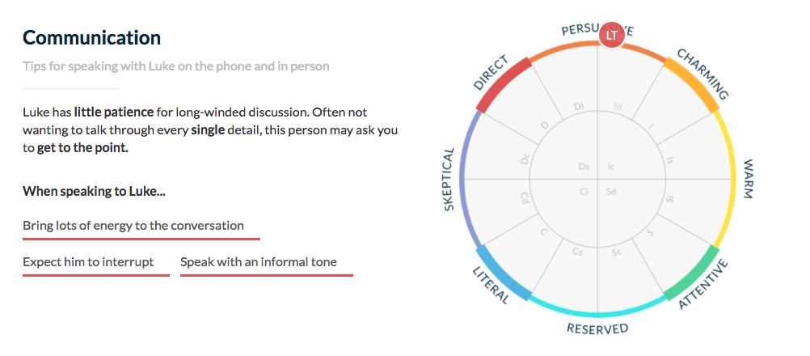

Crystal Javascript SDK
======================
[](https://circleci.com/gh/crystal-project-inc/js_sdk)
[](https://codecov.io/github/crystal-project-inc/js_sdk?branch=master)


This library provides access to Crystal, the world's largest and most accurate personality database!



## FAQ

#### Want to use our raw API?

Find the docs here:
https://developers.crystalknows.com

#### Want to learn more about us?

Visit our website: https://www.crystalknows.com

#### Need an Organization Access Token?

Get in touch with us at hello@crystalknows.com


# Usage

Here's how to install it:
```bash
$ npm install --save crystal_sdk
```

Here's how you use it:

## Synchronous Flow (Recommended)

```js
import CrystalSDK from 'crystal_sdk'

// Set your Organization Access Token
CrystalSDK.key = "OrgApiKey"

// Fetch a profile
CrystalSDK.Profile.search({
  first_name: "Drew",
  last_name: "D'Agostino",
  email: "drew@crystalknows.com",
  location: "Nashville, TN",
  company_name: "Crystal",
  text_sample: "I, Drew, the founder of Crystal, think that ...",
  text_type: "various"
})
  .then((profile) => {
    console.log("Profile found!")
    console.log("First Name:", profile.info.first_name)
    console.log("Last Name:", profile.info.last_name)
    console.log("Predicted DISC Type:", profile.info.disc_type)
    console.log("Prediction Confidence:", profile.info.confidence)
    console.log("Personality Overview:", profile.info.overview)

    console.log("Recommendations:", profile.recommendations)

  })
  .catch(CrystalSDK.Profile.NotFoundYetError, (err) => {
    console.log("Profile was not found in time limit: ", err.request.id)

  })
  .catch(CrystalSDK.Profile.NotFoundError, (err) => {
    console.log("Profile was not found")

  })
  .catch(CrystalSDK.Profile.NotAuthedError, (err) => {
    console.log("The organization token is not valid:", err.token)

  })
  .catch((err) => {
    console.log("Unexpected Error:", err)

  })
```

## Asynchronous Flow (For bulk analysis)

When requesting large amounts of profiles, or when wanting to have more fine-grained control over performance, we recommend using our asynchronous flow. It allows us to process your requests in parallel and get the information back to you more quickly. There are a couple options for using this capability.

### Option 1: Polling (Small Lists + Realtime Enrichment)
The option we use internally in the SDK, is to poll for request information periodically until a set timeout has been reached:

```js
// This example uses bluebird promises
import Promise from 'bluebird'
import CrystalSDK from 'crystal_sdk'

// Decided on retry limit and time between polls
const PAUSE_IN_SECS = 3
const TIME_LIMIT = 30

// Set your Organization Access Token
CrystalSDK.key = "OrgToken"

// Prepare the time limit logic
const timedOut = new Promise((resolve, reject) => {
  setTimeout(reject, TIME_LIMIT * 1000))
})

// Prepare the 'sleep' logic
const sleep = (ms) => {
  return new Promise(resolve => setTimeout(resolve, ms));
}

// Prepare the polling logic
const poll = (searchReq) => {
  return searchReq.didFinish()
    .then((finished) => (
      finished ?
      searchReq.profileInfo() :
      sleep(PAUSE_IN_SECS * 1000).then(() => poll(searchReq))
    ))
}


// Start the request
const query = { first_name: "Drew", ... }
const searchPromise = CrystalSDK.Profile.Request.fromSearch(query)
  .then(poll)
  .then((pd) => new CrystalSDK.Profile(pd.info, pd.recommendations))

// Wait for the response or a timeout
Promise.race([timedOut, searchPromise])
  .then((profile) => {
    ...
  })
  .catch(() => console.log("No profile found..."))
```

Polling can be extended to poll for multiple profiles. It gives the efficiency of our parallel processing, while writing code that behaves synchronously.

This option is great if you want information as fast as possible while keeping open network connections and code complexity to a minimum. It is especially useful if you are requesting multiple profiles and can process the profiles one at a time, as each individual profile comes in (as opposed to waiting for all of them to come in before processing anything).


### Option 2: Background Processing (Large Lists + Passive Enrichment)

Sometimes, it isn't important to have the profile information immediately. Especially when dealing with larger jobs or passive data enrichment. In that case, we allow you to save the Request ID and pull information from the request at a later time via this ID.

```js
// This example uses bluebird promises
import Promise from 'bluebird'
import CrystalSDK from 'crystal_sdk'

// Set your Organization Access Token
CrystalSDK.key = "OrgToken"

// Send the request to Crystal
const query = { first_name: "Drew", ... }

// Pull out the Profile Request ID (string)
CrystalSDK.Profile.Request.fromSearch(query)
  .then((request) => {

    # Pull out the Request ID
    const profileRequestID = requestProfile.id

    # Save the Request ID somewhere (to a database or background job, for example)
    ...
  })

// Later, pull up the Request ID and pull information about it
const savedReq = new CrystalSDK.Profile.Request(profileRequestID)

savedReq.didFinish()
  .then((finished) => finished ? savedReq.didFindProfile() : Promise.reject())
  .then((foundProfile) => (
    foundProfile ?
    profile :
    Promise.reject(new CrystalSDK.Profile.NotFoundError())
  ))
  .then((profile) => {
    ...
  })
  .catch(() => console.log("No profile found"))
```

We try and store your request for a few days after the request has been started. Your Request ID should work when you try to pull information from it for at least that period of time!


## Contributing

- Clone the repository:

  `git clone git@github.com:crystal-project-inc/js_sdk.git`

- Run the tests:

  `npm test`

- Make a code change

- Check that the tests still pass

- Make a pull request!

We will review the Pull Request to make sure that it does not break the external specification of the gem and that it fits with the overall mission of the SDK!

We also encourage people to build further libraries that utilize our SDK and extend the use of the Connect API!
